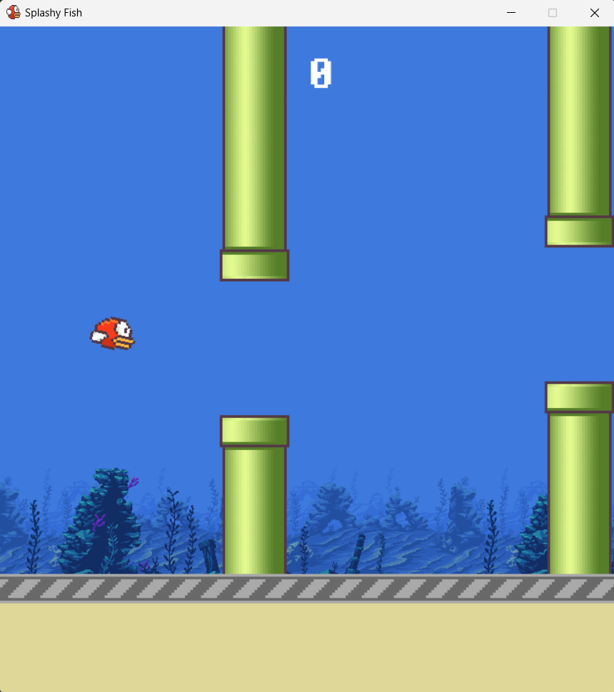

# Splashy Fish
FlappyBird-inspired project using Pygame.

**Splashy Fish** is a fun and interactive game inspired by Flappy Bird, where players control a pixelated bird navigating through pipes while trying to avoid obstacles and achieve the highest score. The game includes a scoring system, restart functionality, and a high score tracker.

## Features
- **Responsive controls**: Control the bird with a simple mouse click to navigate through pipes.
- **Scoring system**: Keep track of your score as you fly through the pipes. 
- **Top Scores**: The game saves and displays the top 3 high scores.
- **Restart button**: Easily restart the game after a Game Over.
- **Background music and sound effects**: (Note: Sound effects are optional and can be added later).

## Game Controls
- **Click the mouse** to make the bird flap upwards.
- Avoid hitting the pipes and the ground.
- **Restart** the game using the restart button on the game over screen.

## Installation and Setup
1. **Install Python**: Ensure Python 3.x is installed on your machine.
2. **Install Pygame**: Install the `pygame` library if you don't have it installed yet. Run the following command:
   ```bash
   pip install pygame
3. **Run the game**:
   - Download the repository.
   - Run the following command in the project directory:
     ```bash
     python bird.py
     ```
     
## Game Resources
- **Bird animation**: The bird sprite consists of 3 different frames to simulate a flying animation.
- **Pipes**: Randomly generated pipes with varying heights create obstacles for the bird.
- **Ground and background images**: Custom assets to enhance the visual experience.

## Assets Used and Attribution
### 1. **Top Scores Icon**
   - **Icon Creator**: tulpahn - Flaticon
   - **Source**: [High score icons created by tulpahn - Flaticon](https://www.flaticon.com/free-icons/high-score)
   - **License**: Free for commercial and personal projects with attribution.
   - **Usage**: Used as the "Top Scores" button image in the game. This icon is scaled down to fit the game UI.

### 2. **Ocean Background Image**
   - **Artwork Creator**: Luis Zuno (@ansimuz)
   - **Source**: [Ansimuz Patreon](https://www.patreon.com/ansimuz)
   - **License**: CC-BY-3.0 (https://creativecommons.org/licenses/by/3.0/)
   - **Usage**: The background image is used in the game to create an underwater fantasy theme.
   
   **Credit**: Artwork created by Luis Zuno (@ansimuz). Licensed under CC-BY-3.0. You are free to copy, modify, distribute, and perform the work, even for commercial purposes, as long as you give appropriate credit.

## How to Attribute:
If you're distributing this game, please include the following attribution links in your project:
- For the **Top Scores icon**:  
  [High score icons created by tulpahn - Flaticon](https://www.flaticon.com/free-icons/high-score)
  
- For the **Ocean Background Image**:  
  **Credit**: Artwork created by Luis Zuno (@ansimuz). Licensed under CC-BY-3.0. Learn more at [Patreon](https://www.patreon.com/ansimuz).

### License Information for the Game:
The code for this game is licensed under the **MIT License**. You are free to modify, distribute, and use the code in your own projects, including commercial ones.

## Contact
If you have any questions or would like to contribute to the project, feel free to reach out via GitHub.
